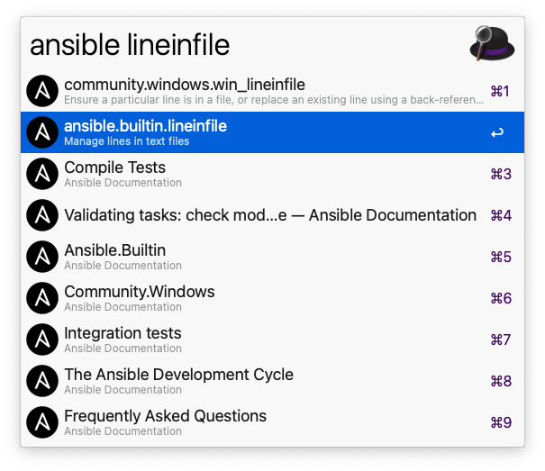
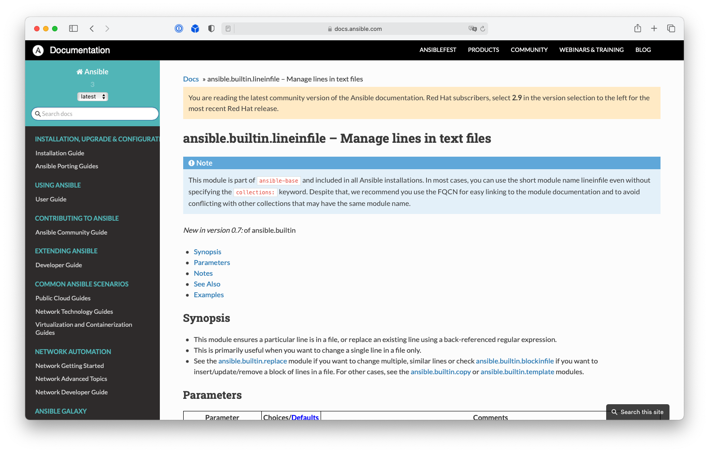

# Alfred Ansible Workflow

An [Alfred](https://www.alfredapp.com) workflow to search the [Ansible module documentation](https://docs.ansible.com/ansible/latest/index.html#).


## Requirements

As macOS still ships [Python 2 which is no longer supported since January 1st, 2020](https://www.python.org/doc/sunset-python-2/#:~:text=The%20sunset%20date%20has%20now,when%20we%20released%20Python%202.7.) - Python 3 is required to be installed. Due to the usage of [f-strings](https://docs.python.org/3/reference/lexical_analysis.html#f-strings) at least Python 3.6 is required. The workflow uses the Python 3 interpreter returned by `/usr/bin/env python3` so the installation method won't matter. However, i do recommend the usage of [homebrew](https://docs.brew.sh/Homebrew-and-Python). The CI tests cover python version up from `3.6`.

Required modules can be installed using pip:

```bash
/usr/bin/env python3 -m pip install -r requirements.txt
```

## Installation

You can either download the workflow from the release page or from packal

* https://github.com/abyth/alfred-ansible-workflow/releases
* http://www.packal.org/workflow/ansible-documentation-search


## Usage

The workflow is triggered using the keyword `ansible` and will use the following input as search parameters.



Pressing `enter` on any of the results will open the corresponding documentation page in the default browser.


